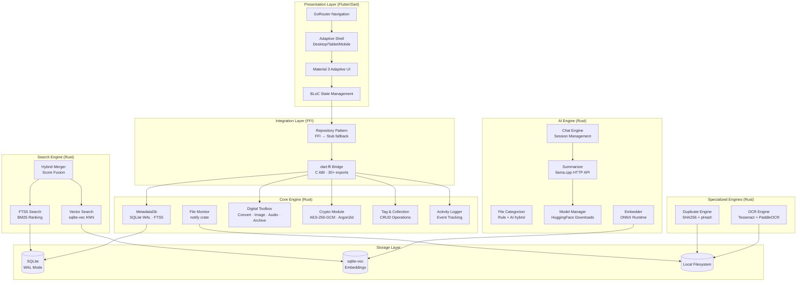

# MemoryOS System Architecture

## Overview

MemoryOS is a **privacy-first, offline-capable Personal Memory Operating System** built on a Rust core with a Flutter adaptive UI. The system processes, indexes, and intelligently manages all user digital content — documents, images, audio, video, screenshots — entirely on-device.

## Core Design Principles

1. **Offline-First**: All AI inference, search, and processing runs locally. No cloud dependency.
2. **Cross-Platform**: Single codebase runs on Windows, macOS, Linux, Android, iOS, and Web.
3. **FFI Bridge**: Flutter UI communicates with the Rust core engine via `dart:ffi` and a C-compatible ABI.
4. **Graceful Degradation**: When native library is unavailable, the app falls back to stub implementations.
5. **Security by Default**: AES-256-GCM encryption, Argon2id KDF, random nonces, zero telemetry.

---

## Layer Architecture

---

## Component Reference

### Rust Core Engine (`crates/core-engine`)

| Module | File | Responsibility |
|--------|------|---------------|
| Database | `database.rs` | SQLite CRUD, FTS5, migrations, tags, collections, activity log |
| FFI Bridge | `ffi.rs` | 30+ C-compatible exports for Flutter integration |
| Models | `models.rs` | FileEntry, Tag, Collection, UserSettings, IndexingStatus |
| Toolbox | `toolbox.rs` | Document conversion, image processing, audio normalization, ZIP archive, encrypted backup/restore |
| Crypto | `crypto.rs` | AES-256-GCM encryption/decryption, Argon2id key derivation |
| File Monitor | `file_monitor.rs` | OS-native filesystem event watching via `notify` crate |
| Config | `config.rs` | Data directory configuration, path derivation |

### AI Engine (`crates/ai-engine`)

| Module | File | Responsibility |
|--------|------|---------------|
| Summarizer | `summarizer.rs` | Text summarization via llama.cpp HTTP API |
| Categorizer | `categorizer.rs` | File type categorization (9 rule-based categories + AI) |
| Chat | `chat.rs` | Multi-turn chat session management |
| Model Manager | `model_manager.rs` | AI model discovery, download orchestration from HuggingFace |
| Embedder | `embedder.rs` | Text embedding generation (ONNX Runtime / hash fallback) |

### Search Engine (`crates/search-engine`)

| Module | File | Responsibility |
|--------|------|---------------|
| FTS | `fts.rs` | FTS5 MATCH search with BM25 ranking, LIKE fallback |
| Vector | `vector.rs` | Semantic similarity search via sqlite-vec |
| Hybrid | `lib.rs` | Score fusion, deduplication, result merging |

### OCR Engine (`crates/ocr-engine`)

| Module | File | Responsibility |
|--------|------|---------------|
| Tesseract | `tesseract.rs` | System subprocess OCR with confidence estimation |
| PaddleOCR | `paddle.rs` | CLI-based OCR with bounding box extraction |

### Duplicate Engine (`crates/duplicate-engine`)

| Module | File | Responsibility |
|--------|------|---------------|
| pHash | `phash.rs` | Perceptual hash (DCT 8×8) for image similarity |
| Core | `lib.rs` | SHA256 exact match + pHash + Hamming distance |

---

## Database Schema

The SQLite database contains 9 tables:

| Table | Purpose |
|-------|---------|
| `files` | Core file metadata (path, type, hash, OCR text, summary) |
| `files_fts` | FTS5 virtual table for full-text search |
| `tags` | User-defined and auto-generated tags |
| `file_tags` | Many-to-many file ↔ tag associations |
| `collections` | Named groupings of files |
| `collection_files` | Many-to-many collection ↔ file associations |
| `user_settings` | Key-value configuration store |
| `activity_log` | Event tracking (file operations, searches) |
| `knowledge_graph_nodes` / `knowledge_graph_edges` | Auto-built concept relationships |
| `ai_models` | Downloaded AI model registry |
| `flashcards` | Spaced repetition learning cards |

---

## FFI Interface Catalog (30+ exports)

### Lifecycle
- `memoryos_init(data_dir)` → Initialize engine
- `memoryos_is_initialized()` → Check engine state
- `memoryos_version()` → Get version string
- `memoryos_free_string(ptr)` → Free Rust-allocated string

### File Operations
- `memoryos_count_files()` → Total indexed file count
- `memoryos_list_files(limit, offset)` → Paginated file listing (JSON)
- `memoryos_get_file(id)` → Single file details (JSON)
- `memoryos_index_file(path)` → Index a new file
- `memoryos_batch_delete(ids)` → Bulk delete files
- `memoryos_search(query)` → Full-text + semantic search (JSON)
- `memoryos_storage_stats()` → Real-time storage analytics (JSON)
- `memoryos_get_large_files(min_size_mb)` → Files above size threshold
- `memoryos_hash_file(file_id)` → Compute and store SHA-256

### Tags
- `memoryos_tag_list()` → All tags (JSON)
- `memoryos_tag_create(name, color)` → Create tag
- `memoryos_tag_file(file_id, tag_id)` → Tag a file

### Collections
- `memoryos_collection_list()` → All collections (JSON)
- `memoryos_collection_create(name, desc)` → Create collection
- `memoryos_collection_add_file(coll_id, file_id)` → Add file to collection

### Vault
- `memoryos_vault_add(id)` → Encrypt file
- `memoryos_vault_remove(id)` → Decrypt file
- `memoryos_vault_list()` → List encrypted files

### Toolbox
- `memoryos_convert_document(in, out)` → Document format conversion
- `memoryos_process_image(in, out, w, h, q)` → Image resize/compress
- `memoryos_normalize_wav(in, out)` → Audio normalization
- `memoryos_archive_list(path)` → List archive contents
- `memoryos_archive_create(out, paths)` → Create ZIP archive
- `memoryos_archive_extract(archive, dir)` → Extract archive

### Backup
- `memoryos_backup_perform(data, path, key)` → Encrypted backup
- `memoryos_backup_restore(path, data, key)` → Restore from backup

---

## Platform Adaptation

The Flutter shell adapts to three form factors:

| Width | Layout | Navigation |
|-------|--------|------------|
| ≥ 1200px | Desktop | Collapsible sidebar (expanded/icons) |
| 700–1199px | Tablet | Navigation rail with leading brand icon |
| < 700px | Mobile | Bottom navigation bar + FAB command palette |

All 14 feature pages share a single `ShellRoute` ensuring consistent navigation state.

---

## Security Model

- **Encryption**: AES-256-GCM with random 12-byte nonce per operation
- **Key Derivation**: Argon2id (memory-hard, resistant to GPU attacks)
- **Nonce Management**: Random nonce prepended to ciphertext (no reuse)
- **Backup Format**: `[nonce 12B] + [AES-GCM ciphertext]`
- **Vault**: Individual file encryption with per-file toggle
- **CI Security**: `cargo-audit` + Trivy filesystem scanning
