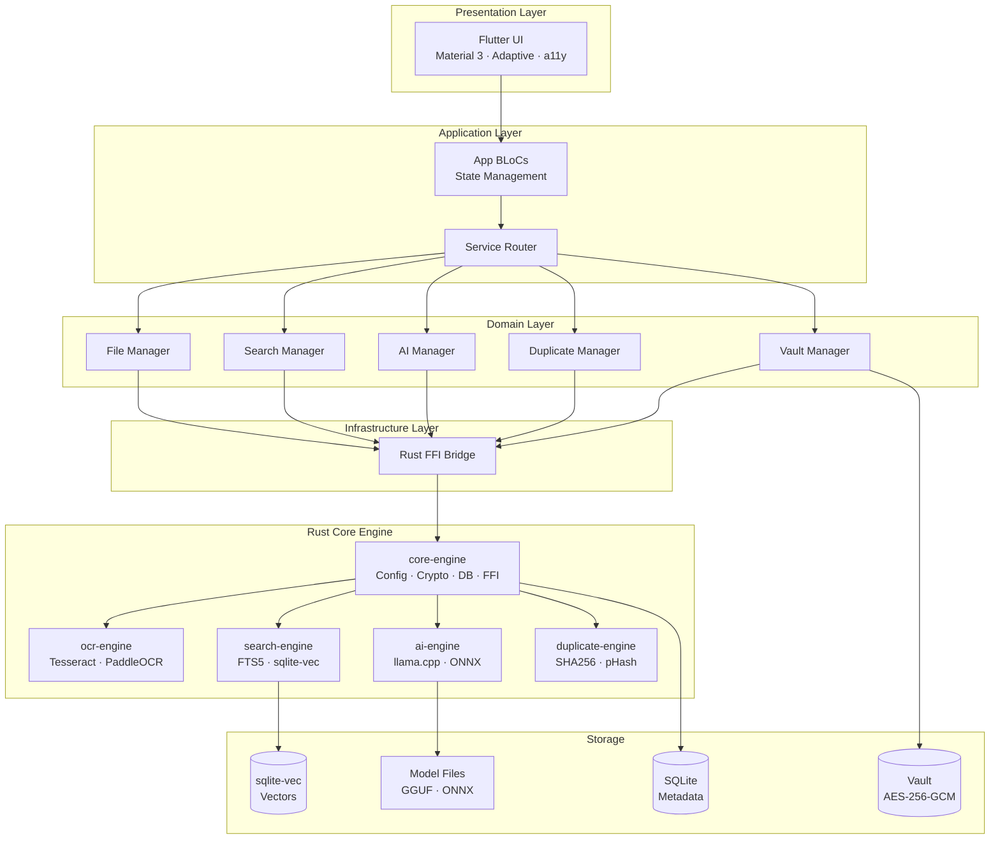
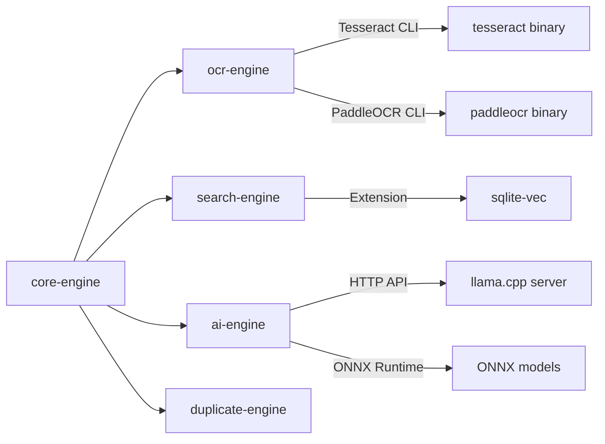
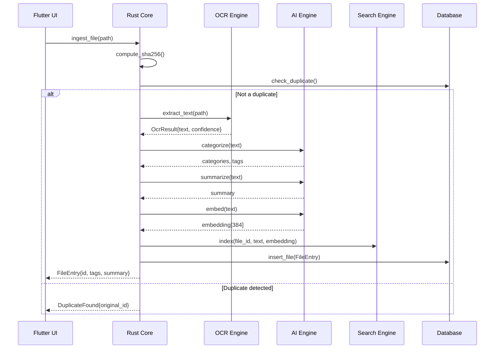
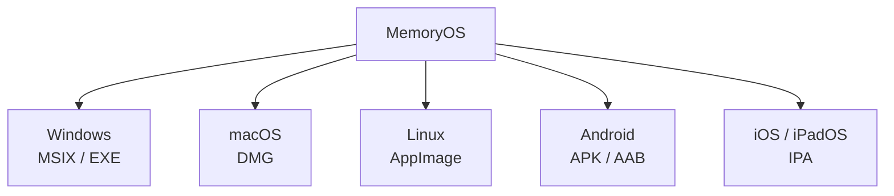

# System Architecture

## Overview

MemoryOS is a clean-architecture, offline-first personal memory operating system. All processing occurs locally on the user's device.

## Clean Architecture Layers

### 1. Presentation Layer
- **Flutter** (Dart) for all platforms
- Material 3 design system
- BLoC pattern for state management
- GoRouter for navigation
- Adaptive layout (sidebar on desktop, bottom nav on mobile)

### 2. Application Layer
- BLoC events and state
- Use case orchestration
- Cross-cutting concerns (logging, error handling)

### 3. Domain Layer
- Pure Dart entities
- Repository interfaces
- Business rules

### 4. Infrastructure Layer
- Rust FFI implementations
- SQLite repositories
- File system adapters

## Rust Crate Architecture

## Data Flow: File Ingestion

## Technology Stack

| Component | Technology |
|-----------|-----------|
| UI Framework | Flutter 3.x + Dart |
| UI Design | Material 3 |
| State Management | flutter_bloc |
| Navigation | go_router |
| Core Engine | Rust (stable) |
| Metadata DB | SQLite (rusqlite) |
| Vector Search | sqlite-vec |
| OCR | Tesseract + PaddleOCR |
| AI Runtime | llama.cpp (GGUF) + ONNX Runtime |
| AI Models | Gemma 2, Phi 3.5, Qwen 2.5, Llama |
| Encryption | AES-256-GCM + Argon2id |
| Hashing | SHA-256 (exact) + pHash (perceptual) |
| CI/CD | GitHub Actions |
| Containers | Docker + Docker Compose |
| Documentation | MkDocs Material |

## Platform Support Matrix

