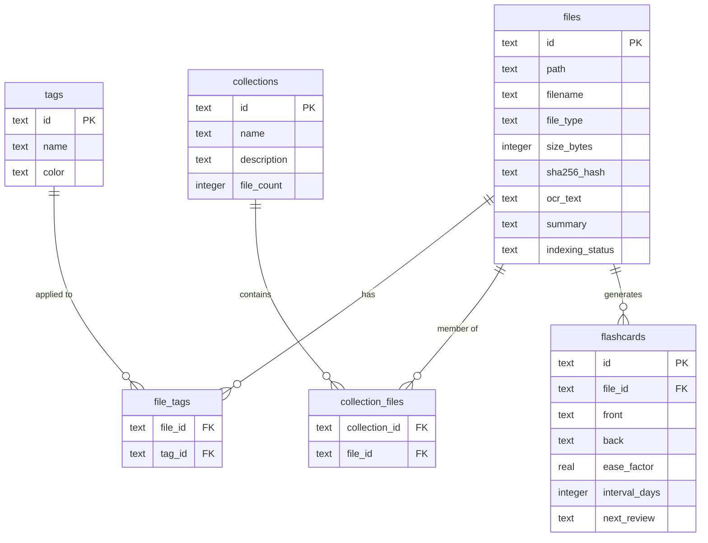

# Database Design

## Overview

MemoryOS uses two databases:
1. **SQLite** (`metadata.db`) — file metadata, tags, collections, activity
2. **sqlite-vec** (`vectors.db`) — embedding vectors for semantic search

## SQLite Schema

### `files` Table (core entity)

```sql
CREATE TABLE files (
    id                TEXT PRIMARY KEY,        -- UUID v4
    path              TEXT NOT NULL UNIQUE,    -- absolute file path
    filename          TEXT NOT NULL,           -- basename
    extension         TEXT NOT NULL DEFAULT '',
    file_type         TEXT NOT NULL,           -- JSON enum
    size_bytes        INTEGER NOT NULL,
    sha256_hash       TEXT,                    -- for exact dedup
    phash             TEXT,                    -- for perceptual dedup (images)
    ocr_text          TEXT,                    -- extracted text
    summary           TEXT,                    -- AI-generated summary
    embedding_id      INTEGER,                 -- FK to vector store
    is_encrypted      INTEGER NOT NULL DEFAULT 0,
    indexing_status   TEXT NOT NULL,
    created_at        TEXT NOT NULL,           -- RFC 3339
    modified_at       TEXT NOT NULL,
    indexed_at        TEXT
);
```

### Relationships



## Vector Store (sqlite-vec)

The `vectors.db` uses the sqlite-vec extension:

```sql
CREATE VIRTUAL TABLE vec_items USING vec0(
    file_id TEXT,
    embedding FLOAT[384]  -- all-MiniLM-L6-v2 dimensionality
);
```

KNN search:
```sql
SELECT file_id, distance
FROM vec_items
WHERE embedding MATCH ?  -- query vector
ORDER BY distance
LIMIT 20;
```
